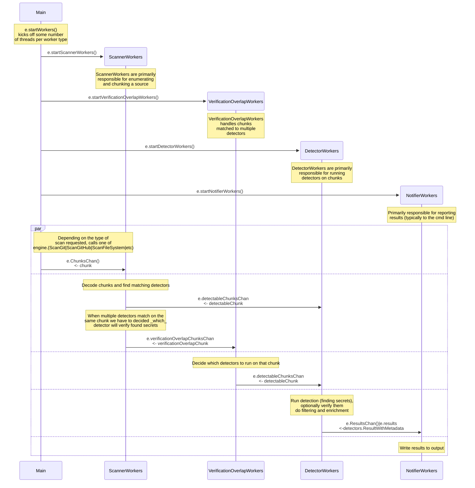

## Concurrency

```mermaid
sequenceDiagram
    %% Setup the workers
    participant Main
    Note over Main: e.startWorkers()<br />kicks off some number<br />of threads per worker type
    create participant ScannerWorkers
    Main->>ScannerWorkers: e.startScannerWorkers()
    Note over ScannerWorkers: ScannerWorkers are primarily<br />responsible for enumerating<br />and chunking a source
    create participant VerificationOverlapWorkers
    Main->>VerificationOverlapWorkers: e.startVerificationOverlapWorkers()
    Note over VerificationOverlapWorkers: VerificationOverlapWorkers<br />handles chunks<br />matched to multiple<br />detectors
    create participant DetectorWorkers
    Main->>DetectorWorkers: e.startDetectorWorkers()
    Note over DetectorWorkers: DetectorWorkers are primarily<br />responsible for running<br />detectors on chunks
    create participant NotifierWorkers
    Main->>NotifierWorkers: e.startNotifierWorkers()
    Note over NotifierWorkers: Primarily responsible for reporting<br />results (typically to the cmd line)
    
    %% Set up the parallelism
    par
        Note over Main,ScannerWorkers: Depending on the type of<br />scan requested, calls one of<br />engine.(ScanGit|ScanGitHub|ScanFileSystem|etc)
        Main->>ScannerWorkers:  e.ChunksChan()<br /><- chunk
    and 
        Note over ScannerWorkers: Decode chunks and find matching detectors
        ScannerWorkers->>DetectorWorkers: e.detectableChunksChan<br /><- detectableChunk
        Note over ScannerWorkers: When multiple detectors match on the<br />same chunk we have to decided _which_<br />detector will verify found secrets
        ScannerWorkers->>VerificationOverlapWorkers: e.verificationOverlapChunksChan<br /><- verificationOverlapChunk
    and
        Note over VerificationOverlapWorkers: Decide which detectors to run on that chunk
        VerificationOverlapWorkers->>DetectorWorkers:  e.detectableChunksChan<br /><- detectableChunk
    and
        Note over DetectorWorkers: Run detection (finding secrets),<br />optionally verify them<br />do filtering and enrichment
        DetectorWorkers->>NotifierWorkers: e.ResultsChan()|e.results<br /><-detectors.ResultWithMetadata
    and
        Note over NotifierWorkers: Write results to output
    end
        
    
```