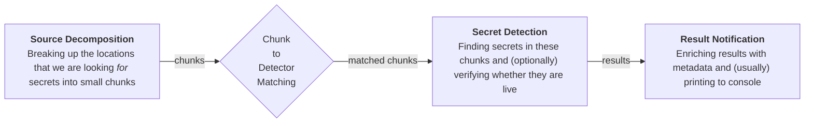
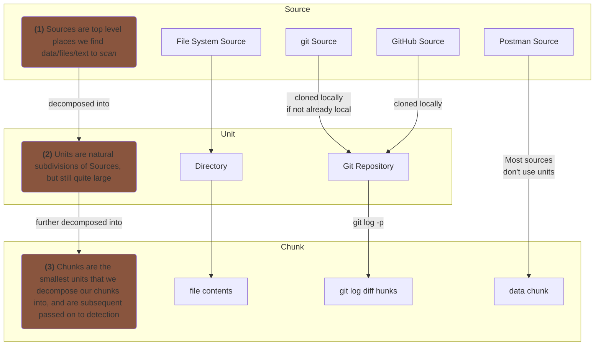
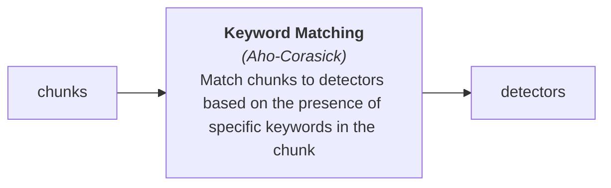
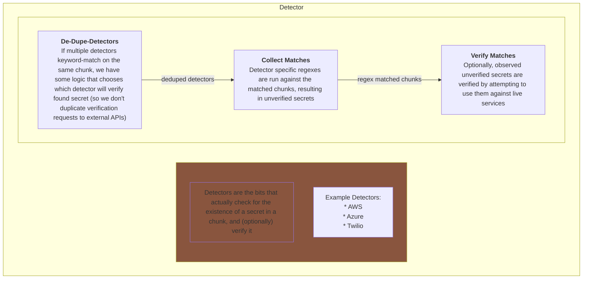
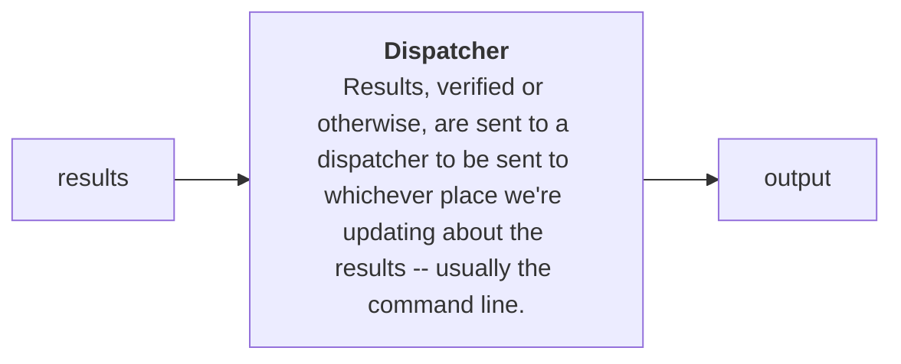

# TruffleHog Process Flows

## Scans

## Data Flow

```mermaid
flowchart LR
    SourceDecomposition["`**Source Decomposition**

Breaking up the locations that we are looking _for_ secrets into small chunks`"]

    DetectorMatching{Chunk<br/>to<br/>Detector<br/>Matching}
    
    SecretDetection["`**Secret Detection**

Finding secrets in these chunks and (optionally) verifying whether they are live`"]

    ResultNotification["`**Result Notification**

Enriching results with metadata and (usually) printing to console`"]
    
    SourceDecomposition -- chunks --> DetectorMatching
    DetectorMatching -- matched chunks --> SecretDetection
    SecretDetection -- results --> ResultNotification
```

#### Source Decomposition

```mermaid
flowchart TD
    subgraph Source
        direction TB
        SourceDescription("`**(1)** Sources are top level places we find data/files/text to _scan_`")
        GitSource["git Source"]
        GitHubSource["GitHub Source"]
        FilesystemSource["File System Source"]
        PostmanSource["Postman Source"]
    end

    subgraph Unit
        direction TB
        UnitDescription("`**(2)** Units are natural subdivisions of Sources, but still quite large`")
        FilesystemUnit[Directory]
        GitUnit[Git Repository]
    end

    subgraph Chunk
        direction TB
        ChunkDescription("`**(3)** Chunks are the smallest units that we decompose our chunks into, and are subsequent passed on to detection`")
        FilesystemChunk[file contents]
        GitRepositoryChunk["`git log diff hunks`"]
        PostmanChunk[data chunk]
    end


    SourceDescription -- decomposed into --> UnitDescription
    UnitDescription -- further decomposed into --> ChunkDescription


    GitSource -- cloned locally<br />if not already local --> GitUnit
    GitHubSource -- cloned locally --> GitUnit
    PostmanSource -- Most sources\ndon't use units --> PostmanChunk
    FilesystemSource --> FilesystemUnit

    GitUnit -- git log -p --> GitRepositoryChunk
    FilesystemUnit --> FilesystemChunk

    style SourceDescription fill:#89553e
    style UnitDescription fill:#89553e
    style ChunkDescription fill:#89553e
```

#### Chunk to Detector Matching

```mermaid
flowchart LR


    KeywordMatching["`**Keyword Matching**
_(Aho-Corasick)_

Match chunks to detectors based on the presence of specific keywords in the chunk`"]
    
    chunks --> KeywordMatching --> detectors
```

#### Secret Detection

```mermaid
flowchart LR

subgraph Detector
    direction RL
    subgraph DetectorDescription["  "]
        DetectorDescriptionText["`Detectors are the bits that actually check for the existence of a secret in a chunk, and (optionally) verify it`"]
        ExampleDetectors["`Example Detectors:
                    * AWS
                    * Azure
                    * Twilio`"]
    end
    
    subgraph DetectorResponsibility[" "]
        direction LR

        De-Dupe-Detectors["`**De-Dupe-Detectors**

If multiple detectors keyword-match on the same chunk, we have some logic that chooses which detector will verify found secret (so we don't duplicate verification requests to external APIs)`"]

        CollectMatches["`**Collect Matches**

Detector specific regexes are run against the matched chunks, resulting in unverified secrets`"]
        VerifyMatches["`**Verify Matches**

Optionally, observed unverified secrets are verified by attempting to use them against live services`"]
        
        De-Dupe-Detectors -- deduped detectors --> CollectMatches
        CollectMatches -- regex matched chunks --> VerifyMatches
    end
    
    style DetectorDescription fill:#89553e
    style DetectorDescriptionText fill:#89553e
end
```

#### Result Notification

```mermaid
flowchart LR

    Dispatcher["`**Dispatcher**

Results, verified or otherwise, are sent to a dispatcher to be sent to whichever place we're updating about the 
results -- usually the command line.`"]
    
    results --> Dispatcher --> output
```

