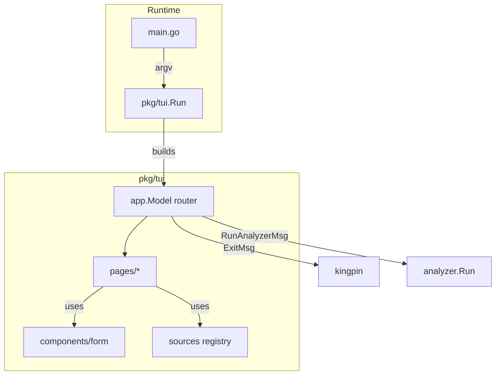
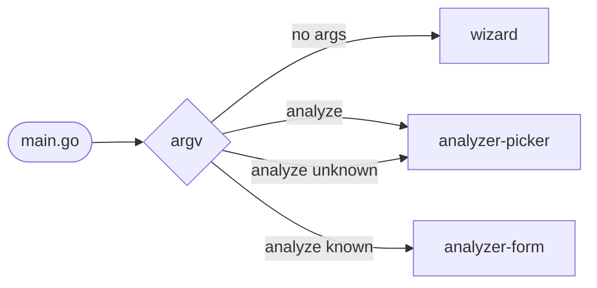
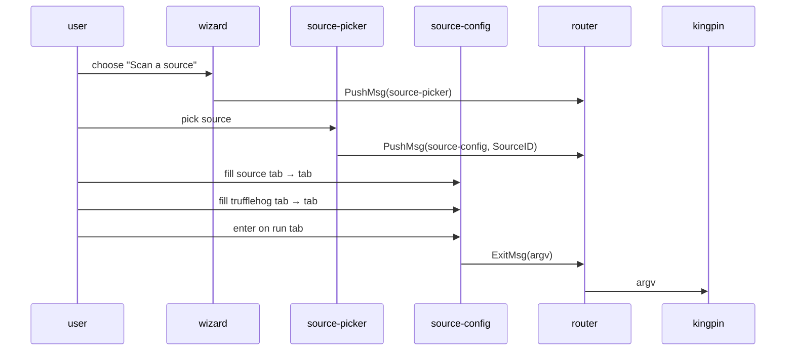
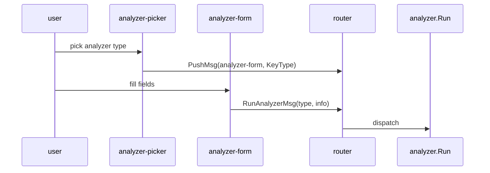

# TruffleHog TUI

The TUI is a Bubble Tea program that lets the user configure a scan or an
analyzer interactively. When it exits, control hands back to `kingpin` (for
scans) or to `pkg/analyzer.Run` (for analyzer flows).

## Architecture

Three layers, nothing else:

1. **`app` — the router.** Owns the page stack, global key handling, the
   shared style sheet and key bindings, and the parent-process handoff
   (argv for kingpin, SecretInfo for the analyzer). Pages know nothing
   about each other; they emit navigation messages and the router
   reacts.

2. **`pages/*` — one directory per page.** Every page implements
   `app.Page`, receives `app.ResizeMsg` for layout, and communicates
   upward with `app.PushMsg` / `app.PopMsg` / `app.ReplaceMsg` /
   `app.ExitMsg` / `app.RunAnalyzerMsg`. Layout is kebab-case
   (`pages/source-picker/`, `pages/analyzer-form/`, …).

3. **`components/form` + `sources` — declarative configuration.**
   `sources.Definition` is a registry entry for each scan source:
   title, description, `form.FieldSpec`s, validators, optional
   `BuildArgs` override. `form.Form` renders the fields, validates
   them, and produces a kingpin-style `[]string` arg vector. The few
   sources with irreducibly complex arg-emission rules (elasticsearch,
   jenkins, postman) provide a `BuildArgs` hook.

## Workflows

### Entry

### Source scan

### Analyzer

## Adding a new source

1. Create `pkg/tui/sources/<id>/` with a `Definition()` returning a
   `sources.Definition`.
2. Declare fields with `form.FieldSpec` — pick the appropriate `Kind`
   (`KindText`, `KindSecret`, `KindCheckbox`, `KindSelect`) and
   `EmitMode` (`EmitPositional`, `EmitLongFlagEq`, `EmitPresence`,
   `EmitRepeatedLongFlagEq`, `EmitConstant`, …). Add validators from
   `form` (`Required`, `Integer`, `OneOf`) and cross-field
   `Constraint`s (`XOrGroup`) as needed.
3. If the arg-emission logic isn't expressible declaratively, set
   `Definition.BuildArgs` to a `func(values map[string]string) []string`.
4. Add `func init() { sources.Register(Definition()) }` and blank-import
   the package from `pkg/tui/tui.go` so the registry picks it up.
5. Add a test case to `pkg/tui/sources/sources_test.go` covering the
   emitted arg vector.

## Adding a new page

1. Create `pkg/tui/pages/<kebab-name>/` with a `Page` type satisfying
   `app.Page`.
2. Export an `ID` constant re-declaring the appropriate `app.PageID` (or
   add a new one to `pkg/tui/app/page.go`).
3. Register a factory in `pkg/tui/tui.go`'s `registerPages`.
4. Emit `app.PushMsg` / `app.PopMsg` / `app.ExitMsg` /
   `app.RunAnalyzerMsg` from the page as appropriate; never touch the
   stack directly.
